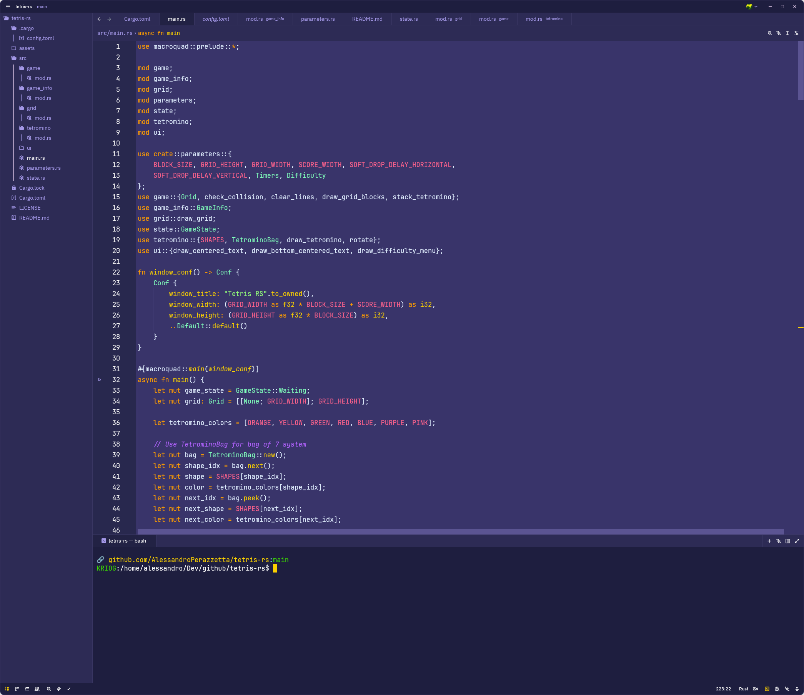

# Purple Theme for Zed

A simple, readable, and visually appealing purple-based theme for the [Zed](https://zed.dev) code editor.



## Features

- **Super Dark and Classic Purple**: Includes both a super dark and a classic purple appearance.
- **Readable Syntax Highlighting**: Carefully chosen colors for clarity and comfort.
- **Consistent UI Elements**: Harmonized colors for editor, sidebar, tabs, and more.
- **Modern Look**: Designed to be easy on the eyes for long coding sessions.

## Installation

### From Source

1. **Clone this repository:**
   ```sh
   git clone https://github.com/AlessandroPerazzetta/zed-purple-theme.git
   ```
2. **Copy or symlink the folder into your Zed themes directory.**
   - The Zed themes directory is usually located at `~/.config/zed/themes/` (Linux) or the equivalent for your OS.
3. **Restart Zed** (if it was open) should apply immediatly when selected.
4. **Enable "Purple Theme"** from the Zed theme settings.

### From Zed Marketplace (when available)

Once published to the Zed marketplace, you will be able to install it directly from the Extensions panel in Zed.

## Usage

After installation, open Zed, go to the theme settings, and select **Purple Theme**. Enjoy coding with a comfortable and modern purple palette!

## Contributing

Contributions are welcome! Feel free to open issues or submit pull requests for improvements, bug fixes, or new features.

## Author

- [Alessandro Perazzetta](https://github.com/AlessandroPerazzetta)

## License

This project is licensed under the [MIT License](LICENSE).

---

> **Purple Theme** – Make your code pop with style and readability!
